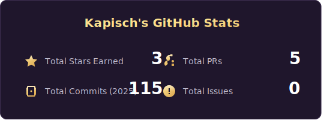
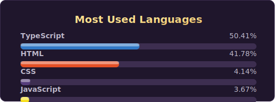

# Hi there, I'm Kapisch 👋

  
  

---

### 👨‍💻 About Me

I am a passionate and self-motivated aspiring developer with a strong focus on front-end technologies. My journey in tech is driven by a love for building intuitive and useful websites and web apps.

- 🚀 I'm currently focused on deepening my expertise in Vibe Coding and learning about the languages on the go.
- 🌱 I'm always learning and exploring new technologies.

---

### 🛠️ My Tech Stack

Here are the primary technologies I work with:

| Frontend         | Backend & Other      | Tools & Platforms      |
| ---------------- | -------------------- | ---------------------- |
| `JavaScript (ES6+)` | `Java`             | `Git & GitHub`         |
| `React`            | `Shell Scripting`    | `VS Code`              |
| `HTML5`            |                      | `Chrome DevTools`      |
| `CSS3`             |                      | `npm`                  |
| `API (REST)`       |                      | `Vercel / Netlify`     |

---

### 📫 How to Connect

I'm always open to connecting with other developers and learning about new things.

